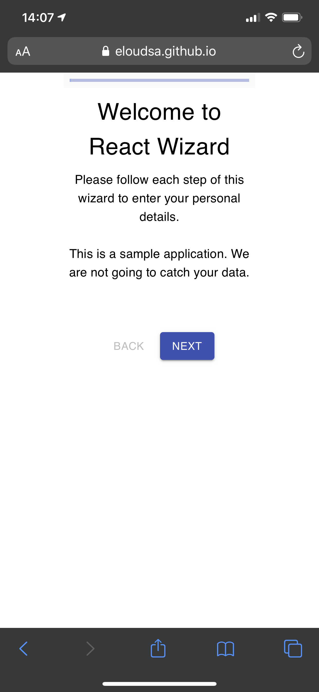

# React Wizard - Sample stepper's app with React and Material UI

This sample application illustrates a way to implement a stepper with React and Material UI.

It has been inspired from Brad Traversy (https://www.youtube.com/watch?v=zT62eVxShsY) and the sample provided in the official Material UI documentation (https://material-ui.com/components/steppers/).

The sample app is visible right here: (https://eloudsa.github.io/react-wizard/)

On the desktop, we use the Stepper component:


On the mobile, we use the MobileStepper component:



## Get the project

Retrieve the project from github:

```bash
# Retrieve the project from github
git clone https://github.com/eloudsa/react-wizard.git
```

## Get dependencies

```bash
# Install the dependencies
npm i
```

## Run the application

```bash
# By default on localhost:3000
npm start
```

## To deploy on GitHub pages

First, you have to configure your GitHub repository to setup Github pages.
Follow instructions desribed here: (https://www.youtube.com/watch?v=ctLFWAanxcI&list=PLZSJRMKZ7946B4tC9tBPBbb-H_LTdU-mI)

Edit the file package.json to mention your GitHub page:

```
homepage="http://your-name/github.io/react-wizard/"
```

## Deploy to your Github repository

```bash
npm run deploy
```

Have fun !!!

## App Info

### Author

Said Eloudrhiri

Credit to:

- Brad Traversy - [Traversy Media](http://www.traversymedia.com)
- [Material UI](https://material-ui.com/)

### Version

1.0.0

### License

This project is licensed under the MIT License
